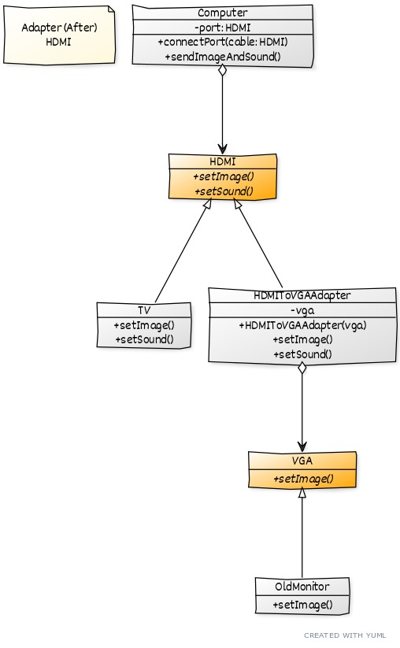

#  Design Patterns Estructural

* Adapter
* Bridge
* Composite
* Decorator
* Facade
* Flyweight
* Mediator
* Proxy

#
### Adapter

O Padrão Adapter converte uma interface de uma classe para outra interface que o cliente espera encontrar. 
O Adaptador permite que classes com interfaces incompatíveis trabalhem juntas.

* Dado que possuo 3 objetos e desejo integrar `VGA` à `HDMI`
    * `TV` que implementa `HDMI`
    * `OldMonitor` que implementa `VGA`
    * `Computer` que tem um parâmetro chamado `HDMI`
* As interfaces `HDMI` e `VGA` são incompatíveis e não podem ser implementadas com os mesmos métodos
* Deve-se criar uma classe adater `HDMIToVGAAdapter` que implemente a interface que desejo fazer a adaptação,
nesse caso, é `HDMI`.
    * A classe adater `HDMIToVGAAdapter` deve ter método `connectPort` que receba um objeto do tipo `VGA` como parâmetro
    * O objeto do tipo `VGA` deve ser usado na implementação caso necessário
* Uso: 
    * Ter uma instancia do tipo `OldMonitor`
    * Passar essa instância como parâmetro no método `connectPort` do objeto `HDMIToVGAAdapter`
    * Chamar método que realize a implementação `sendImageAndSound`

#
### Bridge

#
### Composite

#
### Decorator

#
### Facade

#
### Flyweight

#
### Mediator 

#
### Proxy