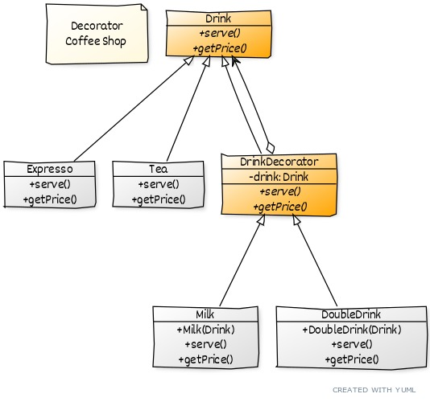

#  Design Patterns Estructural

* Adapter
* Bridge
* Composite
* Decorator
* Facade
* Flyweight
* Mediator
* Proxy

#
### Adapter

O Padrão Adapter converte uma interface de uma classe para outra interface que o cliente espera encontrar. 
O Adaptador permite que classes com interfaces incompatíveis trabalhem juntas.

* Dado que possuo 3 objetos e desejo integrar `VGA` à `HDMI`
    * `TV` que implementa `HDMI`
    * `OldMonitor` que implementa `VGA`
    * `Computer` que tem um parâmetro chamado `HDMI`
* As interfaces `HDMI` e `VGA` são incompatíveis e não podem ser implementadas com os mesmos métodos
* Deve-se criar uma classe adater `HDMIToVGAAdapter` que implemente a interface que desejo fazer a adaptação,
nesse caso, é `HDMI`.
    * A classe adater `HDMIToVGAAdapter` deve ter método `connectPort` que receba um objeto do tipo `VGA` como parâmetro
    * O objeto do tipo `VGA` deve ser usado na implementação caso necessário
* Uso: 
    * Ter uma instancia do tipo `OldMonitor`
    * Passar essa instância como parâmetro no método `connectPort` do objeto `HDMIToVGAAdapter`
    * Chamar método que realize a implementação `sendImageAndSound`

#
### Bridge

Desacoplar uma abstração de sua implementação para que os dois possam variar independentemente.

* Possuir classe abstrata `Employee`
* Os objetos concretos `ITGuy` e `ProjectManager` devem estender essa classe
* Possuir interface `Converter` que deve ser implementada pelas classes `CSVConverter` e `JsonConverter`
* Uso:
    * Instanciar a classe do tipo converter que deseja utilizar
    * Ter uma instancia de `ITGuy` e `ProjectManager`
    * Passar objeto como parâmetro no `getEmployeeFormated` que vem do converter
* Com isso, evitamos de criar `ITGuyJson`, `ProjectManagerJson`, `ITGuyCsv` e `ProjectManagerCsv`, fazendo com que a 
aplicação possua um grande número de classes concretas.

#
### Composite

Compor objetos em estruturas de árvore para representar hierarquias todo-parte. Composite permite que clientes tratem 
objetos individuais e composições de objetos de maneira uniforme.

* Possuir uma interface `FileSystemItem`, que pode ser um nó ou uma folha (uma pasta ou um arquivo)
* Possuir uma classe concreta chamada `CompositeFolder`, que implementa `FileSystemItem`
    * A `CompositeFolder` deve ter uma lista de `FileSystemItem`, que podem ser tanto pastas como arquivos 
    (Onde ocorre o composite)
    

#
### Decorator

Anexar responsabilidades adicionais a um objeto dinamicamente. Decorators oferecem uma alternativa flexível ao uso de 
herança para estender uma funcionalidade.

* Possuir uma interface `Drink`, onde essa interface sera implementada tanto pelos objetos concretos quanto pelos 
decorators
* As classes `Expresso` e `Tea` devem implementar `Drink`
* O Decorator `DrinkDecorator` deve ser uma classe abstrata e deve implementar `Drink`
* As classes `Milk` e `DoubleDrink` devem implementar `DrinkDecorator`
* Uso:
    * Sem decorar o objeto `new Expresso()`
    * Decorando o objeto `new DoubleDrink(new Expresso())` ou `new Milk(new DoubleDrink(new DoubleDrink(new Expresso())))`
* Basicamente, eu instancio os objetos concretos, dentro dos objetos que estendem do decorator, e os objetos concretos
serão decorados. Com isso, os objetos concretão passar a ter as novas resposabilidades sendo adicionadas de acordo com 
o decorator que eu utilizar.

#
### Facade

#
### Flyweight

#
### Mediator 

#
### Proxy